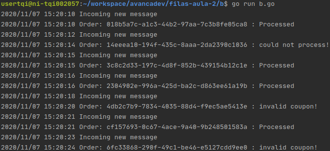
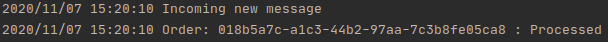
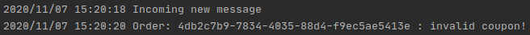
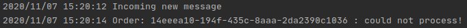

# Desafio 02

Foram criadas as filas e exchanges para o RabbitMQ, sendo que, após os testes foram obtidos os seguintes resultados:

### Execução completa do lote:

### Cenário de sucesso (Processed):

### Cenário de falha (Cupom inválido):

### Cenário de falha (Connection error - could not process):

